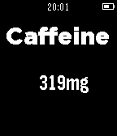

Caffeine Counter for Pebble
===============

Counts your caffeine consumption during the day and calculates the amount of caffeine in your blood.

## How to use it
Measure your daily caffeine consumption and calculate how much caffeine is in your blood.

Increase/decrease caffeine intake with the up and down buttons. 
Press long to increase/decrease by 100.
Long press select to reset.
The caffeine amount is calculated automatically.

# FAQ
Q: Do I have to keep the app open all the time?
A: No, your caffeine count is saved in your Pebble's storage.

Q: Does it work 100% correct?
A: No, it's impossible to calculate it 100% correct, but this Watchapp is there to give you an idea of how much's in your blood. Don't use it for medical purposes.

## Screenshots

 
